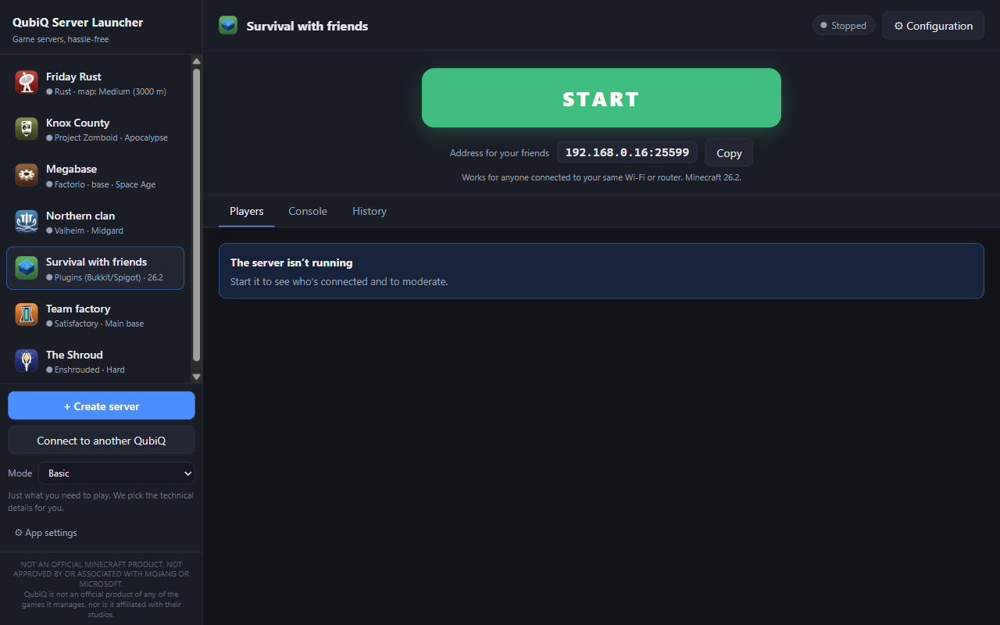
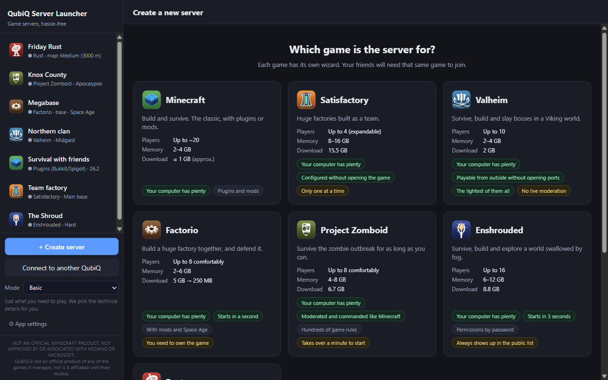
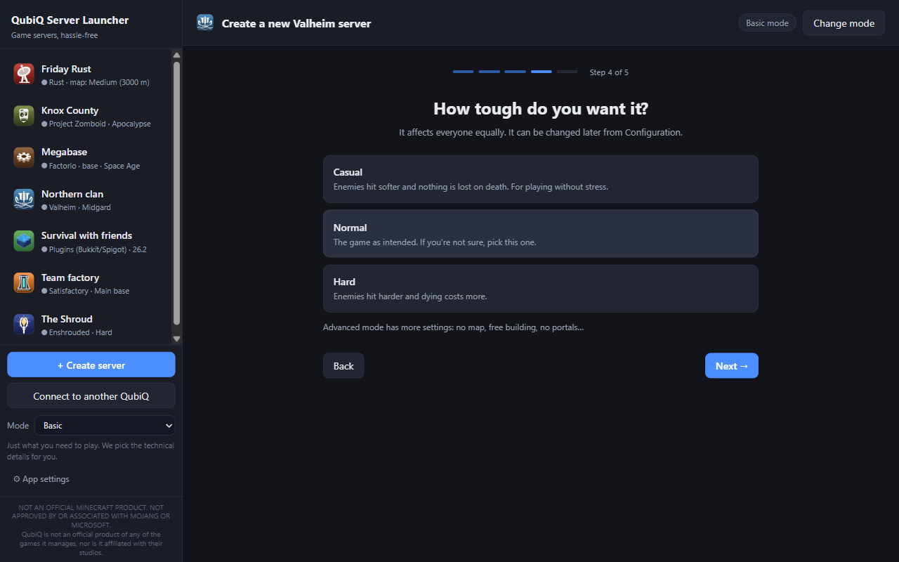
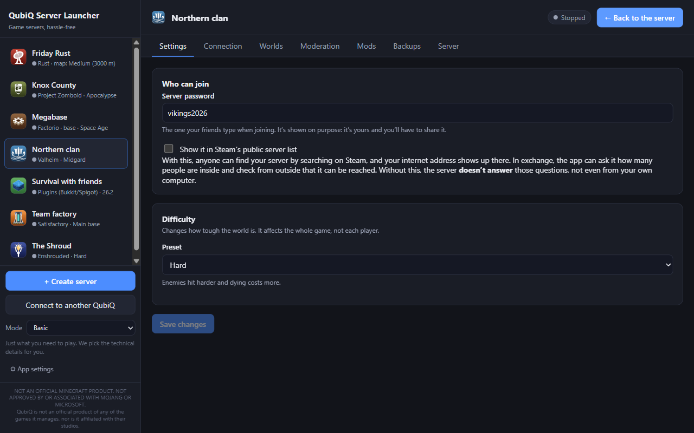

# QubiQ Server Launcher

Create and manage your game server in three clicks.

A free, open-source Windows desktop app that downloads, configures, starts and moderates servers
for **Minecraft**, **Satisfactory**, **Valheim**, **Factorio**, **Project Zomboid**, **Enshrouded**
and **Rust**, with no Java to install, no configuration files to edit and no command line.

> NOT AN OFFICIAL MINECRAFT PRODUCT. NOT APPROVED BY OR ASSOCIATED WITH MOJANG OR MICROSOFT.
> Unofficial tool: not associated with or approved by the studios of the games it manages
> ([trademarks](#trademarks)).

*[Versión en español](README.md)* · The app speaks ten languages; the project's documentation and
code are written in Spanish.

| Pick the game, seeing what it needs against your computer | In basic mode, one question per screen | Every game's settings, explained |
|---|---|---|
|  |  |  |

---

## Download and install

Get the latest version from
[Releases](https://github.com/AitorMencias/qubiq-server-launcher/releases/latest):

| File | What for |
|---|---|
| `QubiQ-Server-Launcher-Setup-<version>.exe` | Installer. Installs **for your user only**, without asking for administrator rights, and creates shortcuts. |
| `QubiQ-Server-Launcher-<version>-portable.exe` | A single file, no installation. Handy for trying it out or carrying it on a USB stick. |

Every release also publishes the SHA-256 of both files, so you can check that what you downloaded
is what was published.

**Windows will warn you the first time.** The executable isn't signed with a paid certificate, so
SmartScreen shows "Windows protected your PC". Click **More info → Run anyway**. This happens to any
unsigned program without an established reputation; the source code of every version is in this
repository, under that version's tag.

### Requirements

- **64-bit Windows 10 or 11** (x64).
- **Nothing else to install.** Java for Minecraft, SteamCMD for the Steam games and everything else
  are downloaded by the app from their official sources.
- Memory and disk space **depend on the game**: when you create a server, the app compares what it
  needs with what your computer has and what's already running, and warns you if it won't fit.
  Steam games take from 2 GB (Valheim) to 15.5 GB (Satisfactory).

---

## Games

| Game | How it's installed | Good to know |
|---|---|---|
| **Minecraft** | Vanilla, Paper (plugins), Fabric, Forge and NeoForge (mods), or **a server you already have** (a server pack, a hand-built folder) | Automatic Java. Official plugins configured through a form |
| **Satisfactory** | Steam (15.5 GB) | The app claims the server and creates the save without opening the game |
| **Valheim** | Steam (2 GB) | Friends can join from outside **without opening ports**, with the game's own crossplay code |
| **Factorio** | You need to own the game: it's copied from your installation or downloaded with your Steam account | Moderation through the remote console, and mods from the official portal |
| **Project Zomboid** | Steam (6.7 GB) | Console, moderation and Workshop mods. Without Steam, it isn't advertised anywhere |
| **Enshrouded** | Steam (8.8 GB) | Permissions by role password, and mods with Shroudtopia. ⚠ **Always shows up in the game's public server list**: this can't be avoided |
| **Rust** | Steam (5.5 GB) | Monthly wipe with reminders or on a schedule, and uMod plugins with Oxide. ⚠ **Always shows up in the game's public server list** |

When a game doesn't allow something, the app tells you instead of hiding it.

---

## What it does

- **Two modes.** When creating a server you choose **basic** (it doesn't ask about version, memory
  or port) or **advanced** (everything). You can switch later from the sidebar. In both, the server
  screen is a big START/STOP button, the players and the console; everything else lives in
  *Configuration*, where advanced mode unlocks more options.
- **Create.** In basic mode, a walkthrough with one question per screen (name, type, players, game
  mode, difficulty, world, player-vs-player and connection) ending in an editable summary; in
  advanced mode, a full form. The game is picked on a screen that compares players, memory against
  your computer's, and download size.
- **Minecraft servers you already have.** Pick the folder; the app recognises what it is and which
  version, and starts it with its own script but with the right Java.
- **Start and stop.** Supervised start-up, live console and clean shutdown that saves the world. If
  the app is closed abruptly with servers running, it picks them back up when you reopen it.
- **Configure.** Each game's settings in plain language, with explanations. The configuration files
  of any Minecraft plugin or mod can be edited from the app without losing the author's comments.
- **Worlds.** Several per server: create, switch between them and delete.
- **Plugins and mods.** For Minecraft, the websites to get them from, a step-by-step guide and the
  list of installed ones, which you can turn on and off. In Satisfactory, Valheim, Factorio and Rust
  they're searched and installed from the app; in Project Zomboid, with the Steam Workshop link; in
  Enshrouded, the app installs the mod loader and you pick each mod's file.
- **Moderate.** Who's connected, with whatever actions each game allows: kick, ban, grant admin…
- **Backups.** While running, scheduled, with retention and restore.
- **Connection.** The addresses to join from home and from outside, checked with each game's real
  protocol, and a guide to open ports on your router or use playit.gg.
- **History.** Who joined and left, what was moderated and what was typed in the console, per
  server.
- **Remote control.** Start, stop, restart and watch the console from your phone or another PC,
  through a page served by the app itself over HTTPS. **Only those commands**: from outside, nobody
  can touch the configuration, the files or the computer. Each device is paired with a code and has
  its own permissions. Off by default. You can also manage **another QubiQ**'s servers from here,
  with the same limits.
- **Ten languages.** Spanish, English, Russian, German, Italian, French, Portuguese, Chinese, Hindi
  and Japanese. It starts in your Windows language and can be changed in *App settings*. Some error
  messages are still only in Spanish.
- **Movable data folder.** It can be moved to another drive from *App settings*.

---

## Your data

Servers, worlds, backups and downloads live in `%APPDATA%\qubiq-server-launcher`, **outside the
installation folder**: uninstalling the app doesn't delete your worlds. They can be moved to another
folder from *App settings → Data folder*.

**The app sends no telemetry or usage statistics.** It only connects to the internet when needed
(downloading a server, searching for mods, checking whether people can join from outside…), and it
warns you about the games that advertise the server in a public list. Every connection is listed,
in Spanish, in [PRIVACIDAD.md](PRIVACIDAD.md).

---

## Help, bugs and ideas

- **A bug or an idea:** open an [issue](https://github.com/AitorMencias/qubiq-server-launcher/issues),
  in English or Spanish.
- **A security problem:** don't post it in an issue; follow [SECURITY.md](SECURITY.md) (in Spanish:
  use **Security → Report a vulnerability** on this repository).
- **Contributing code:** [CONTRIBUTING.md](CONTRIBUTING.md) and
  [docs/DESARROLLO.md](docs/DESARROLLO.md) (building, testing and how it's made), both in Spanish.
- **What changed in each version:** [CHANGELOG.md](CHANGELOG.md) (in Spanish).

---

## Trademarks

QubiQ Server Launcher is an independent, unofficial tool. Game names belong to their owners and
are used only to say what it's compatible with:

- **Minecraft** is a trademark of Mojang Synergies AB / Microsoft. NOT AN OFFICIAL MINECRAFT
  PRODUCT. NOT APPROVED BY OR ASSOCIATED WITH MOJANG OR MICROSOFT.
- **Satisfactory** belongs to Coffee Stain Studios.
- **Valheim** belongs to Iron Gate AB.
- **Factorio** belongs to Wube Software.
- **Project Zomboid** belongs to The Indie Stone.
- **Enshrouded** belongs to Keen Games.
- **Rust** belongs to Facepunch Studios.
- **Steam** and **SteamCMD** belong to Valve Corporation.

The game icons in the app are original drawings, not the official logos. The app doesn't include or
redistribute any game: it downloads the servers from their official sources, and where you need to
own the game (Factorio), it uses your own copy or your account.

---

## License

Copyright © 2026 AitorMencias. QubiQ Server Launcher is free software: you can redistribute it and/or
modify it under the terms of the [GNU General Public License](LICENSE), version 3 or (at your
option) any later version. It is distributed **without any warranty**.

The licenses of the third-party code included in the app are in *App settings → About →
Third-party notices*.
