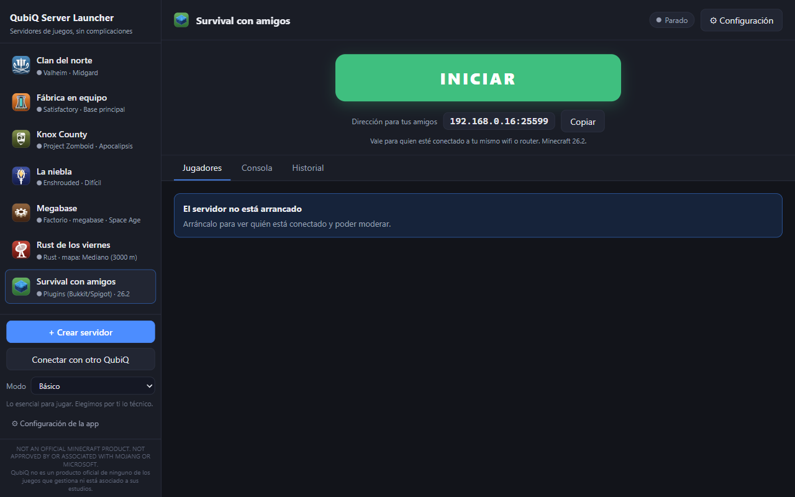
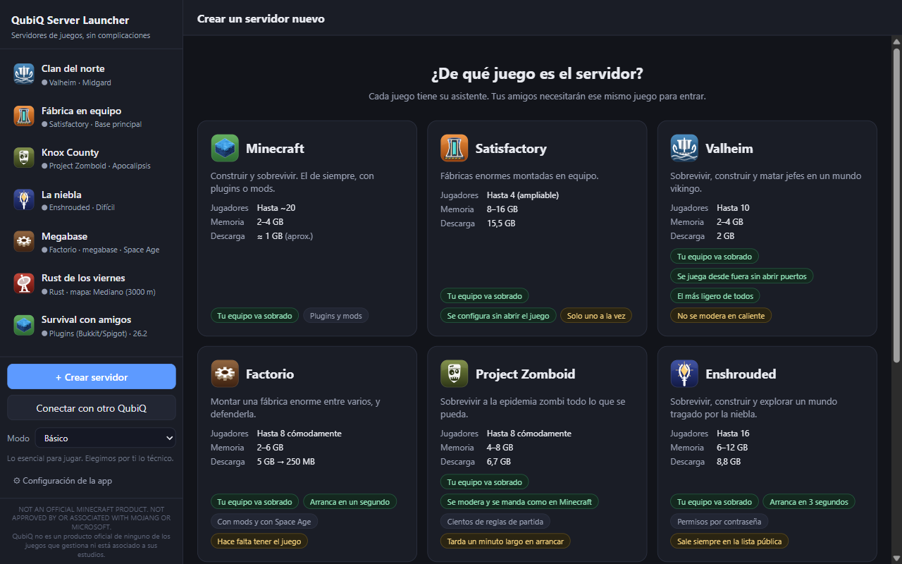
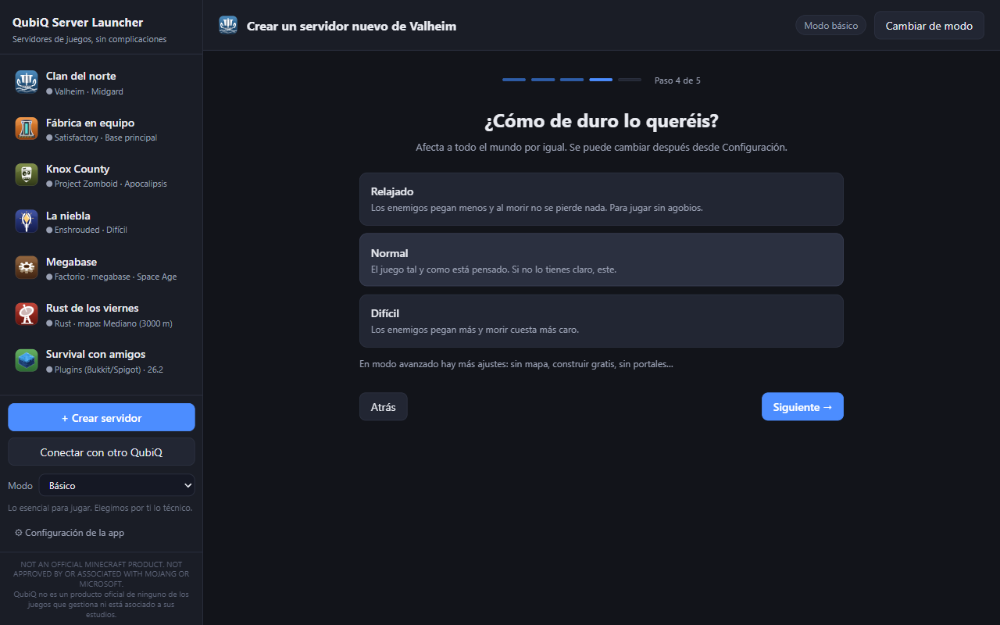
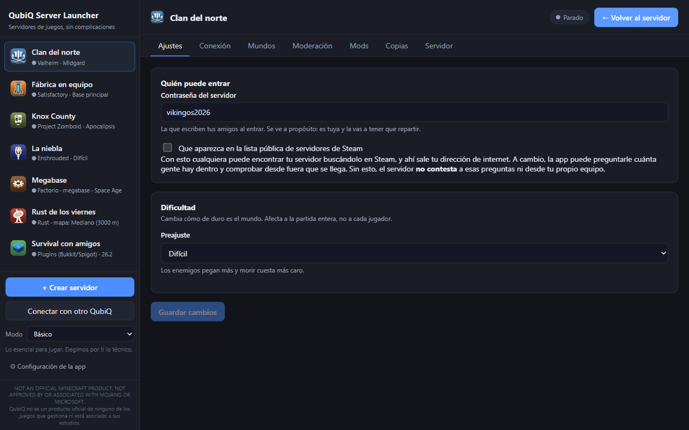

# QubiQ Server Launcher

Crea y gestiona tu servidor de juegos en tres clics.

Aplicación de escritorio para Windows, gratuita y de código abierto, que descarga, configura,
arranca y modera servidores de **Minecraft**, **Satisfactory**, **Valheim**, **Factorio**,
**Project Zomboid**, **Enshrouded** y **Rust**, sin instalar Java, editar ficheros de
configuración ni tocar la línea de comandos.

> NOT AN OFFICIAL MINECRAFT PRODUCT. NOT APPROVED BY OR ASSOCIATED WITH MOJANG OR MICROSOFT.
> Herramienta no oficial: no está asociada a los estudios de los juegos que gestiona ni aprobada
> por ellos ([marcas](#marcas)).

*[English version](README.en.md)*

| Eliges el juego viendo lo que pide frente a tu equipo | En modo básico, una pregunta por pantalla | Los ajustes de cada juego, explicados |
|---|---|---|
|  |  |  |

---

## Descargar e instalar

Descarga la última versión desde
[Releases](https://github.com/AitorMencias/qubiq-server-launcher/releases/latest):

| Fichero | Para qué |
|---|---|
| `QubiQ-Server-Launcher-Setup-<versión>.exe` | Instalador. Se instala **solo para tu usuario**, sin pedir permisos de administrador, y crea accesos directos. |
| `QubiQ-Server-Launcher-<versión>-portable.exe` | Un solo fichero, sin instalar. Cómodo para probarlo o llevarlo en un USB. |

Cada release publica también el SHA-256 de los dos ficheros, para comprobar que lo descargado es lo
publicado.

**La primera vez, Windows avisará.** El ejecutable no está firmado con un certificado de pago,
así que SmartScreen muestra «Windows protegió su PC». Pulsa **Más información → Ejecutar de todas
formas**. Le pasa a cualquier programa sin firma y sin reputación acumulada; el código de cada
versión está en este repositorio, con la etiqueta de su versión.

### Requisitos

- **Windows 10 u 11 de 64 bits** (x64).
- **Nada más que instalar.** Java para Minecraft, SteamCMD para los juegos de Steam y el resto los
  descarga la propia app de sus fuentes oficiales.
- Memoria y disco **según el juego**: al crear un servidor, la app compara lo que pide con lo que
  tiene tu equipo y lo que ya está en marcha, y avisa si no cabe. Los juegos de Steam ocupan de 2 GB
  (Valheim) a 15,5 GB (Satisfactory).

---

## Juegos

| Juego | Cómo se instala | Lo que conviene saber |
|---|---|---|
| **Minecraft** | Original (vanilla), Paper (plugins), Fabric, Forge y NeoForge (mods), o **un servidor que ya tengas** (un server pack, una carpeta montada a mano) | Java automático. Plugins oficiales que se configuran con un formulario |
| **Satisfactory** | Steam (15,5 GB) | La app reclama el servidor y crea la partida sin abrir el juego |
| **Valheim** | Steam (2 GB) | Se puede jugar desde fuera **sin abrir puertos**, con el código de crossplay del propio juego |
| **Factorio** | Hace falta tener el juego: se copia de tu instalación o se baja con tu cuenta de Steam | Moderación por consola remota y mods del portal oficial |
| **Project Zomboid** | Steam (6,7 GB) | Consola, moderación y mods del Taller. Sin Steam, no se anuncia en ningún sitio |
| **Enshrouded** | Steam (8,8 GB) | Permisos por contraseña de rol y mods con Shroudtopia. ⚠ **Sale siempre en la lista pública del juego**: no se puede evitar |
| **Rust** | Steam (5,5 GB) | Borrado mensual avisado o programado, y plugins de uMod con Oxide. ⚠ **Sale siempre en la lista pública del juego** |

Lo que un juego no deja hacer, la app lo dice en vez de esconderlo.

---

## Qué hace

- **Dos modos.** Al crear un servidor eliges **básico** (no pregunta versión, memoria ni puerto) o
  **avanzado** (todo). Se cambia después desde la barra lateral. En los dos, la pantalla del
  servidor es un botón grande INICIAR/PARAR, los jugadores y la consola; el resto está en
  *Configuración*, donde el avanzado desbloquea más opciones.
- **Crear.** En básico, un recorrido de una pregunta por pantalla (nombre, tipo, jugadores, modo de
  juego, dificultad, mundo, peleas entre jugadores y conexión) que acaba en un resumen editable; en
  avanzado, un formulario completo. Al crear se elige juego en una pantalla que compara jugadores,
  memoria frente a la de tu equipo y descarga.
- **Servidores de Minecraft que ya tienes.** Eliges la carpeta, la app reconoce qué es y de qué
  versión, y arranca con su propio script pero con el Java que toca.
- **Lanzar y parar.** Arranque supervisado, consola en vivo y parada limpia, que guarda el mundo.
  Si la app se cierra de golpe con servidores en marcha, al volver a abrirla los recupera.
- **Configurar.** Los ajustes de cada juego en lenguaje llano, con sus explicaciones. Los ficheros
  de configuración de cualquier plugin o mod de Minecraft se editan desde la app sin perder los
  comentarios del autor.
- **Mundos.** Varios por servidor: crear, cambiar de uno a otro y borrar.
- **Plugins y mods.** En Minecraft, las webs donde descargarlos, guía paso a paso y lista de lo
  instalado con activar y desactivar. En Satisfactory, Valheim, Factorio y Rust se buscan e
  instalan desde la app; en Project Zomboid, con el enlace del Taller de Steam; en Enshrouded, la
  app pone el cargador de mods y tú eliges el fichero de cada uno.
- **Moderar.** Quién está conectado, con las acciones que permita cada juego: expulsar, vetar, dar
  permisos de administrador…
- **Copias de seguridad.** En caliente, programadas, con retención y restauración.
- **Conexión.** Las direcciones para entrar desde casa y desde fuera, comprobadas con el protocolo
  real de cada juego, y una guía para abrir puertos en el router o usar playit.gg.
- **Historial.** Quién entró y salió, qué se moderó y qué se escribió en la consola, por servidor.
- **Control remoto.** Arrancar, parar, reiniciar y ver la consola desde el móvil u otro PC, con
  una página que sirve la propia app por HTTPS. **Solo esas órdenes**: desde fuera no se toca la
  configuración, los ficheros ni el equipo. Cada dispositivo se empareja con un código y tiene sus
  permisos. Desactivado de serie. También se pueden manejar desde aquí los servidores de **otro
  QubiQ**, con los mismos límites.
- **Diez idiomas.** Español, inglés, ruso, alemán, italiano, francés, portugués, chino, hindi y
  japonés. Arranca en el de Windows y se cambia en *Configuración de la app*. Algunos mensajes de
  error todavía salen solo en español.
- **Carpeta de datos movible.** Se puede llevar a otro disco desde *Configuración de la app*.

---

## Tus datos

Los servidores, mundos, copias de seguridad y descargas viven en
`%APPDATA%\qubiq-server-launcher`, **fuera de la carpeta de instalación**: desinstalar la app no
borra tus partidas. Se pueden llevar a otra carpeta desde *Configuración de la app → Carpeta de
datos*.

**La app no envía telemetría ni estadísticas de uso.** Solo se conecta a internet para lo que
hace falta (descargar un servidor, buscar mods, comprobar si se puede entrar desde fuera…), y
avisa de los juegos que anuncian el servidor en una lista pública. El detalle de cada conexión está
en [PRIVACIDAD.md](PRIVACIDAD.md).

---

## Ayuda, fallos y propuestas

- **Un fallo o una idea:** abre un [issue](https://github.com/AitorMencias/qubiq-server-launcher/issues).
- **Un problema de seguridad:** no lo publiques en un issue; sigue [SECURITY.md](SECURITY.md).
- **Colaborar con código:** [CONTRIBUTING.md](CONTRIBUTING.md) y
  [docs/DESARROLLO.md](docs/DESARROLLO.md) (compilar, probar y cómo está hecho).
- **Qué ha cambiado en cada versión:** [CHANGELOG.md](CHANGELOG.md).
- **Por qué está hecho así:** [ANALISIS.md](ANALISIS.md), con el diario de desarrollo en §19. La
  investigación de cada juego está en [INVESTIGACION-JUEGOS.md](INVESTIGACION-JUEGOS.md) y el plan
  por fases en [HOJA-DE-RUTA-MULTIJUEGO.md](HOJA-DE-RUTA-MULTIJUEGO.md).

---

## Marcas

QubiQ Server Launcher es una herramienta independiente y no oficial. Los nombres de los juegos
pertenecen a sus dueños y se usan solo para decir con qué es compatible:

- **Minecraft** es una marca de Mojang Synergies AB / Microsoft. NOT AN OFFICIAL MINECRAFT PRODUCT.
  NOT APPROVED BY OR ASSOCIATED WITH MOJANG OR MICROSOFT.
- **Satisfactory** es de Coffee Stain Studios.
- **Valheim** es de Iron Gate AB.
- **Factorio** es de Wube Software.
- **Project Zomboid** es de The Indie Stone.
- **Enshrouded** es de Keen Games.
- **Rust** es de Facepunch Studios.
- **Steam** y **SteamCMD** son de Valve Corporation.

Los iconos de los juegos de la app son dibujos propios, no los logotipos oficiales. La app no
incluye ni redistribuye ningún juego: descarga los servidores de sus fuentes oficiales, y donde
hace falta tener el juego (Factorio), usa tu propia copia o tu cuenta.

---

## Licencia

Copyright © 2026 AitorMencias. QubiQ Server Launcher es software libre: puedes redistribuirlo y
modificarlo según los términos de la [Licencia Pública General de GNU](LICENSE), versión 3 o (a tu
elección) cualquier versión posterior. Se distribuye **sin ninguna garantía**.

Las licencias del código de terceros que incluye la app están en *Configuración de la app → Acerca
de → Avisos de terceros*.
